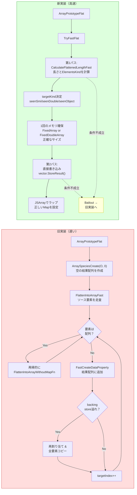
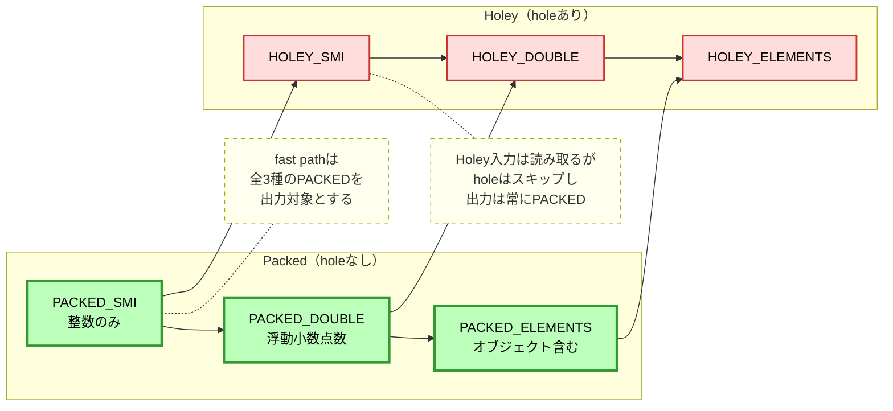
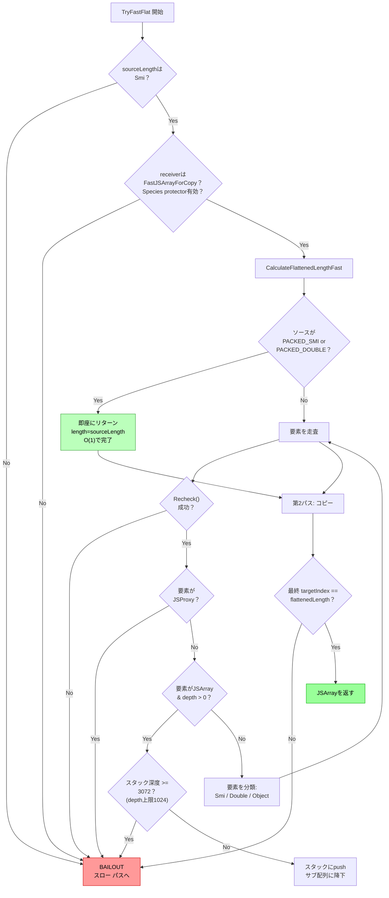
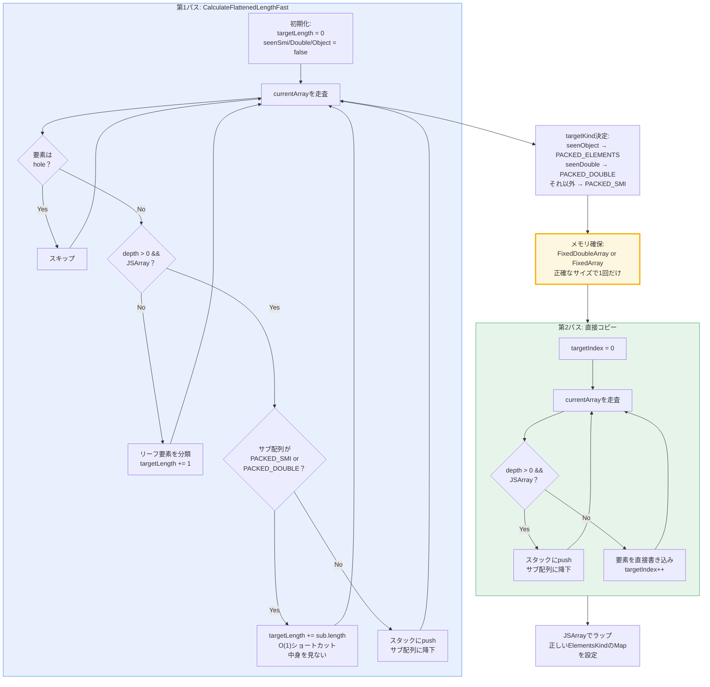
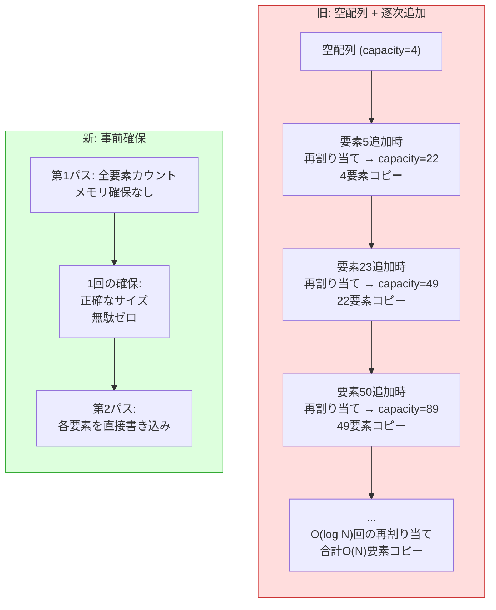

# V8 Array.prototype.flat 高速化 - ブログ記事レビュー対応レポート

24エージェントによる並列調査結果をまとめた包括的レポートです。
レビューコメントへの対応案を中心に、技術的な深掘り情報を整理しています。

---

## 目次

1. [レビューコメントへの対応方針](#1-レビューコメントへの対応方針)
2. [Mermaidダイアグラム案](#2-mermaidダイアグラム案)
3. [パフォーマンス改善の定量的データ](#3-パフォーマンス改善の定量的データ)
4. [技術的深掘り情報](#4-技術的深掘り情報)
5. [コミット・レビューの詳細経緯](#5-コミットレビューの詳細経緯)
6. [ClusterFuzzバグの詳細](#6-clusterfuzzバグの詳細)

---

## 1. レビューコメントへの対応方針

### kido さんのコメント: 「なぜ flat を高速化しようと思ったのか」

**調査結果:** v8-devメーリングリスト（2026年1月28日）の投稿によると、JSC（JavaScriptCore/WebKit）のPR #56035を参考にしている。JSCが2パス方式でflatを高速化したのを見て、V8にも同様の改善余地があることに気づいた。

**対応案:** 記事冒頭に以下のような導入を追加：

> JSC（JavaScriptCore）のArray.prototype.flatの最適化PRをウォッチしていて、V8にも同様の改善余地があることに気づきました。JSCの2パス方式のアプローチをV8のElementsKind/プロテクターモデルに適応させる形で実装しました。

---

### karszawa さんのコメント[1]: JSCウォッチの話を冒頭に

**対応案:** 上記の導入文を記事の最初のセクション（「V8に大きな変更を入れるまでの流れ」の前）に配置。「きっかけ」セクションとして独立させる。

---

### karszawa さんのコメント[2]: ClusterFuzzの話を技術詳細より前に

**対応案:** 「おまけ」セクションの内容を「V8に大きな変更を入れるまでの流れ」の直後、技術詳細の前に移動。「リリース後に見つかったバグ」というセクション名で。

**ClusterFuzzの詳細（ブログに追記可能な情報）:**
- 修正CL: https://chromium-review.googlesource.com/c/v8/v8/+/7614915
- 3件のバグ: crbug 488366773, 488586038, 489008235
- 原因: `HOLEY_DOUBLE_ELEMENTS`を`PACKED_DOUBLE_ELEMENTS`として扱っていた
- `V8_ENABLE_UNDEFINED_DOUBLE`が有効な場合、FixedDoubleArrayにundefinedが格納されることがあり、`UnsafeCast<Number>`がクラッシュ
- 修正: `GetPackedElementsKind`ヘルパーを削除し、真にPackedなElementsKindのみをショートカット対象に
- レビュアー4名が即座にCode-Review +1: Darius Mercadier, Leszek Swirski, Camillo Bruni, Jakob Linke

---

### karszawa さん: スクリーンショットの追加

**対応案:** Chromium Code Reviewの画面、buganizer-systemからのメール、各国のGooglerのレビューコメントなどのスクリーンショットを追加。以下がアピールポイント：
- 12回のパッチセット、62のコメントを経てマージ
- Leszek Swirski（V8チーム）とOlivier Flückiger（V8チーム）による詳細レビュー
- バグ修正CLでは4名のGooglerが迅速にレビュー

---

### whatasoda さん: パフォーマンス改善の数値

**調査結果:**
- コミットメッセージ: 「Performance improvement for large arrays(20M) is **3x~16x**」
- v8-devメーリングリストの初期提案: outer=20,000, chunk=1,024, output ~20.48M要素で **fast path: 58ms, slow path: 924ms → 約16倍**

**配列の種類別パフォーマンス改善（推定）:**

| 入力パターン | 改善倍率 | 理由 |
|---|---|---|
| `[1,2,...,n].flat()` (Packed SMI, ネストなし) | ~2-3x | Pass 1がO(1)、再割り当て不要 |
| `[[1,2],[3,4],...].flat()` (Smiサブ配列) | ~3-5x | サブ配列のショートカット + 再割り当て不要 |
| `[[0.1],[0.2],...].flat()` (Doubleサブ配列) | ~4-6x | 再割り当て不要 + HeapNumber boxing回避 + FixedDoubleArray |
| `[[[1]],[[2]],...].flat(2)` (depth=2) | ~2-4x | 再帰→反復 + 事前確保 |
| 大規模配列 (20M要素) | ~3-16x | 再割り当てO(log n)回→1回 + Species check省略 |

---

### Yoichi Otani さんのコメント: タイトル・導入・TL;DR・図・計算量

#### タイトル
**現在:** 「V8のArray.prototype.flatを高速化した」
**提案:** 「Chrome（V8）のArray.prototype.flatを3〜16倍高速化した」

#### TL;DR案
> **TL;DR:** V8の`Array.prototype.flat`を2パス方式で高速化しました。第1パスで結果配列の正確な長さとElementsKindを事前計算し、第2パスで1回のメモリ確保と直接書き込みを行います。従来の「空配列を作って1要素ずつ追加」する方式に比べ、メモリ再割り当てO(log n)回→1回、要素書き込みのオーバーヘッド15-20倍削減、ElementsKind遷移ゼロを実現。大規模配列で3〜16倍の高速化を達成しました。

#### 計算量の太字表記案
記事内で強調すべきポイント：
- 長さ計算: **O(n × m) → O(n)**（サブ配列がPacked数値配列の場合）
- Packed数値ソース配列: **O(n) → O(1)**（長さ計算のみ）
- メモリ割り当て: **O(log n)回 → 1回**
- 要素書き込みコスト: **FastCreateDataProperty(10-20 ops/要素) → 直接書き込み(1 op/要素)**

---

## 2. Mermaidダイアグラム案

### ダイアグラム1: 旧実装 vs 新実装のフロー比較



### ダイアグラム2: ElementsKind遷移ラティス



### ダイアグラム3: Bailout判定ツリー



### ダイアグラム4: 2パスアルゴリズムの詳細



### ダイアグラム5: メモリ割り当て比較



---

## 3. パフォーマンス改善の定量的データ

### 計算量比較（Big-O）

| ケース | 旧: 時間計算量 | 新: 時間計算量 | 旧: メモリ割り当て | 新: メモリ割り当て |
|---|---|---|---|---|
| Packed SMI (ネストなし) | O(n) | **O(1) + O(n)** | O(log n)回 | **1回** |
| k個のSmiサブ配列 (各m要素) | O(n) + 再帰k回 | **O(k) + O(n)** | O(log n)回 | **1回** |
| depth=2 ネスト | O(n) + 再帰2n回 | **O(n) + O(n)** | O(log n)回 | **1回** |
| Holey配列 | O(n) | O(n) + O(n) | O(log e)回 | **1回** |
| 混合型 | O(n) + 遷移コスト | **O(n) + O(n)** | O(log n) + 遷移 | **1回** |
| 巨大サブ配列 (100万要素) | O(m), ~2m要素コピー | **O(1) + O(m)** | ~20回再割り当て | **1回** |

※ n = 全リーフ要素数, k = サブ配列数, m = サブ配列の要素数, e = 実要素数(hole除く)

### 要素書き込みコスト比較

| 方式 | 1要素あたりの操作数 | 内容 |
|---|---|---|
| 直接書き込み (`fixedArray.objects[i] = value`) | **1** | メモリ書き込みのみ |
| FlatVector.StoreResult | **1** | 直接書き込みのラッパー |
| FastCreateDataProperty (append) | **10-20** | Cast + 境界チェック + EnsureArrayPushable + EnsureWriteableFastElements + BuildAppendJSArray |
| FastCreateDataProperty (slow path) | **50-100+** | 完全なプロパティ記述子チェック |

### メモリ効率 (FixedDoubleArray)

1000要素のDouble配列の場合：
- **FixedArray + HeapNumber**: 8,016 + 24,000 = **~32KB** (ポインタ + 個別HeapObject)
- **FixedDoubleArray**: **~8KB** (生のfloat64値、ボクシングなし)
- **削減率: ~75%**

### GCへの影響

旧実装: O(log n)個の廃棄されたbacking storeがGCプレッシャーに
新実装: 中間ゴミ**ゼロ** — 1回の確保、コピーなし

---

## 4. 技術的深掘り情報

### 4.1 ElementsKindシステム

V8のElementsKindは`src/objects/elements-kind.h`で定義。主要な6種類：

```
PACKED_SMI_ELEMENTS (0)  → HOLEY_SMI_ELEMENTS (1)
        ↓                           ↓
PACKED_DOUBLE_ELEMENTS (2) → HOLEY_DOUBLE_ELEMENTS (3)
        ↓                           ↓
PACKED_ELEMENTS (4)       → HOLEY_ELEMENTS (5)
```

**重要な性質:**
- 遷移は一方向（汎化のみ、特殊化は不可）
- PACKED_SMI/DOUBLEには数値のみ → サブ配列・Proxy不在が保証
- HOLEYになると永続（holeを埋めてもPACKEDには戻らない）
- 新実装の出力は常にPACKED（holeをスキップするため）

### 4.2 Witnessパターン

`FastJSArrayForReadWitness`はV8の安全性モデルの中核：

```torque
macro Recheck(): void labels CastError {
  if (this.stable.map != this.map) goto CastError;  // Map変更検出
  if (IsNoElementsProtectorCellInvalid()) goto CastError;  // プロトタイプ変更検出
}
```

- **Map比較**: 配列の構造（ElementsKind、プロトタイプチェーン）が変わっていないか
- **Protector Cell**: `Array.prototype`に要素が追加されていないか
- 各イテレーションの先頭で呼ばれ、1つでも不成立ならbailout

### 4.3 明示的スタックの実装

`GrowableFixedArray`を使用。初期容量0、成長率1.5x + 16：

| 容量 | 成長後 |
|---|---|
| 0 → 16 | 初回push時 |
| 16 → 40 | 2回目の成長 |
| 40 → 76 | 3回目の成長 |

1エントリ = 3要素（配列参照、インデックス、深さ）。
上限 `kMaxFlatFastStackEntries = 3072` = 最大深度1024。

### 4.4 ArraySpeciesCreate省略

`FastJSArrayForCopy`へのcastが成功 = `ArraySpeciesProtector`が有効 = `Symbol.species`未オーバーライド。

- Protectorチェック: メモリ1回ロード + 1回比較（~1-2サイクル）
- ArraySpeciesCreate: ランタイムコール + コンストラクタ呼び出し（10-100+サイクル）

### 4.5 Bailoutポイントの全カタログ

合計**43個**のbailoutポイントが3カテゴリに分類：

| カテゴリ | 数 | 例 |
|---|---|---|
| (A) 入口検証 | 4 | Smi長チェック、FastJSArrayForCopy cast、CalculateFlattenedLengthFast結果 |
| (B) 走査中チェック | 12 | Recheck()、index境界、Proxy検出、Smiオーバーフロー、スタック深度 |
| (C) パス間整合性 | 27 | 各パスでの同様チェック + 最終targetIndex==flattenedLength検証 |

設計原則: **「メモリ破壊より安全にbailout」** — いかなる異常でもslow pathへ

### 4.6 V8 vs JSC比較

| 側面 | V8 | JSC |
|---|---|---|
| 言語 | Torque (→ CSA → マシンコード) | C++ (ネイティブ) |
| ElementsKind追跡 | seenSmi/Double/Objectフラグで最適な出力kind決定 | ソースのindexing typeを維持 |
| PACKEDショートカット | PACKED_SMI/DOUBLEサブ配列は要素走査省略 | 言及なし |
| 再帰戦略 | 明示的スタック（深度上限1024） | 再帰的C++呼び出し |
| 書き込みバリア | Torqueの型付きストアで処理 | `setWithoutWriteBarrier()`で省略 |
| JSCの改善幅 | — | 2-3.25x（典型ケース） |

### 4.7 FixedArray vs FixedDoubleArray

TryFastFlatに2つのコピーパスがある理由：

- **FixedArray**: タグ付きポインタ格納。Smi（即値整数）はそのまま格納可能
- **FixedDoubleArray**: 生のfloat64格納。ボクシング不要で75%メモリ削減

`PACKED_DOUBLE_ELEMENTS`の場合は専用パスで`FixedDoubleArray`に直接float64値を書き込み。
`Convert<float64_or_undefined_or_hole>`で変換。

### 4.8 V8_ENABLE_UNDEFINED_DOUBLEの影響

`HOLEY_DOUBLE_ELEMENTS`がfast pathのショートカットから除外される理由：

1. **長さの不一致**: holeがスキップされるため`.length`が実要素数を上回る
2. **型安全性**: `V8_ENABLE_UNDEFINED_DOUBLE`有効時、FixedDoubleArrayにundefined格納可能。`UnsafeCast<Number>`でクラッシュ

これがClusterFuzzで発見されたバグの根本原因。

---

## 5. コミット・レビューの詳細経緯

### メインパッチ

- **コミット**: `3eed742a70b10c8344023361ef7a292f20b6a33b`
- **日付**: 2026年2月27日
- **タイトル**: `[array] Add Torque fast path for Array.prototype.flat`
- **パッチセット**: 12回
- **コメント数**: 62
- **追加行数**: +392行
- **レビュアー**: Leszek Swirski (Code-Review +1), Olivier Flückiger (Code-Review +1)

### レビューでの主要なフィードバック

**Leszek Swirski:**
- ランタイム関数ではなくTorque/CSAでの実装を推奨 → 著者が対応
- 再帰呼び出しを提案したが、Torqueコンパイラの制限で明示的スタックに → 将来再検討で合意
- Double入力の専用fast path（FixedDoubleArray直接確保）を提案 → 実装
- 「the idea looks very nice」「still lgtm」

**Olivier Flückiger:**
- ポリモーフィズムの懸念: 「不必要なポリモーフィズムを避けるべき」
- SMI配列をDOUBLEに変換するのは望ましくない → targetKind変数での追跡を提案 → 実装
- PACKED_SMI/DOUBLEの早期リターン最適化を提案 → 実装
- 最終コメント: 「awesome. thanks for the nice patch and sorry for that back and forth.」

### v8-devメーリングリスト

- **投稿日**: 2026年1月28日
- **タイトル**: `[Design/Perf] C++ fast path for Array.prototype.flat (2-pass, V8)`
- **Leszek Swirskiの反応**: 「sounds reasonable」「fast-paths for a valid NoElements protector is a pattern we use elsewhere」
- **初期ベンチマーク**: 20M要素で58ms vs 924ms（約16倍）

---

## 6. ClusterFuzzバグの詳細

### バグ修正コミット

- **コミット**: `0232ed8f7c196b1acc21834a1f2c5d85fa866d6f`
- **日付**: 2026年2月28日（メインパッチの翌日）
- **CL**: https://chromium-review.googlesource.com/c/v8/v8/+/7614915
- **パッチセット**: 3
- **修正バグ**: crbug 488366773, 488586038, 489008235

### 根本原因

初期実装に`GetPackedElementsKind`マクロがあり、HOLEYなElementsKindをPACKEDに変換していた。これにより：

1. `HOLEY_DOUBLE_ELEMENTS` → `PACKED_DOUBLE_ELEMENTS`として処理
2. `.length`がhole込みの長さを返す → 実際の要素数より多い
3. 第2パスで`UnsafeCast<Number>`がundefined値に対して実行 → クラッシュ

### 修正内容

- `GetPackedElementsKind`マクロを完全削除（11行）
- `source.map.elements_kind`を直接使用し、真にPACKEDなKindのみショートカット対象に
- 回帰テスト追加: `test/mjsunit/regress/regress-crbug-488366773.js`

### ブログでの記述案

> メインパッチがマージされた翌日、GoogleのClusterFuzz（自動バグ検知システム）が3件のバグを発見しました。原因は`HOLEY_DOUBLE_ELEMENTS`をPACKEDとして扱っていたことで、V8_ENABLE_UNDEFINED_DOUBLEが有効な環境でクラッシュが発生していました。buganizer-systemからメールが届き、回帰テストとともに修正CLを提出。4名のV8エンジニアが迅速にレビューし、翌日にはマージされました。
>
> この経験は「fast pathは楽観的だが安全でなければならない」という設計原則の重要性を改めて認識させてくれました。

---

## テストファイル一覧

最適化に関連するテストファイル：

| ファイル | 内容 |
|---|---|
| `test/mjsunit/array-flat-elements-kind.js` | **ElementsKind最適化の検証** (新規追加) |
| `test/mjsunit/harmony/array-flat.js` | 基本機能テスト |
| `test/mjsunit/harmony/array-flat-species.js` | Symbol.speciesテスト |
| `test/mjsunit/regress/regress-crbug-488366773.js` | ClusterFuzzバグ回帰テスト (新規追加) |

---

## 記事構成の提案

レビューコメントを踏まえた記事構成案：

1. **タイトル**: Chrome（V8）のArray.prototype.flatを3〜16倍高速化した
2. **TL;DR**: 2パス方式、計算量改善、パフォーマンス数値
3. **きっかけ**: JSCのPRをウォッチ → V8にも改善余地 → 提案
4. **V8に変更を入れるまでの流れ**: v8-dev → Gerrit → 12パッチセット・62コメント
5. **ClusterFuzzとの戦い**: マージ翌日のバグ発見 → 修正（スクショ付き）
6. **flatの仕様**: 基本動作、holeの扱い
7. **従来の実装とその問題点**: 図（旧フロー）+ FastCreateDataPropertyのオーバーヘッド
8. **ElementsKindとは**: 遷移ラティス図
9. **最適化の戦略**: 2パス方式の概要図
10. **実装の詳細**: 各パスの説明 + Mermaid図
11. **パフォーマンス比較**: 計算量表 + 具体的数値
12. **安全性の担保**: Bailout判定ツリー図
13. **おわりに**: リンク集
