# V8 エンジン型システム 包括的調査レポート

> 本レポートは V8 JavaScript エンジンの型システムを24の並列調査エージェントにより徹底分析した結果をまとめたものである。

---

## 目次

1. [概要: V8の多層型システム](#1-概要-v8の多層型システム)
2. [ポインタタギング - 最下層の型識別](#2-ポインタタギング---最下層の型識別)
3. [InstanceType と Map (Hidden Class)](#3-instancetype-と-map-hidden-class)
4. [HeapObject クラス階層](#4-heapobject-クラス階層)
5. [文字列型階層](#5-文字列型階層)
6. [数値型システム](#6-数値型システム)
7. [Turbofan コンパイラ型システム (ビットセット型格子)](#7-turbofan-コンパイラ型システム-ビットセット型格子)
8. [型格子演算 (Union / Intersect / Is / Maybe)](#8-型格子演算)
9. [OperationTyper - 演算の型推論](#9-operationtyper---演算の型推論)
10. [Maglev コンパイラ型システム](#10-maglev-コンパイラ型システム)
11. [Map遷移とElementsKind](#11-map遷移とelementskind)
12. [インラインキャッシュ (IC) と型プロファイリング](#12-インラインキャッシュ-ic-と型プロファイリング)
13. [フィードバックベクターと型ヒント](#13-フィードバックベクターと型ヒント)
14. [型ナローイングとTypeGuard](#14-型ナローイングとtypeguard)
15. [機械表現型とSimplifiedLowering](#15-機械表現型とsimplifiedlowering)
16. [Torque 型システム](#16-torque-型システム)
17. [WebAssembly 型システム](#17-webassembly-型システム)
18. [脱最適化と型フィードバックループ](#18-脱最適化と型フィードバックループ)
19. [コンパイラパイプラインにおける型情報フロー](#19-コンパイラパイプラインにおける型情報フロー)
20. [付録: 主要ファイル一覧](#20-付録-主要ファイル一覧)

---

## 1. 概要: V8の多層型システム

V8 は JavaScript を高速に実行するため、**複数の階層にまたがる型システム**を持つ。動的型付き言語である JavaScript には静的な型がないため、V8 は実行時に型情報を収集・推論し、最適化に活用する。

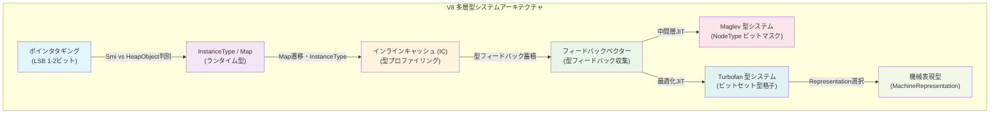

### 型システムの各層の役割

| 層 | 場所 | 目的 | 粒度 |
|---|---|---|---|
| ポインタタギング | 全値 | Smi/HeapObject の即座判別 | 1-2ビット |
| InstanceType/Map | ヒープオブジェクト | オブジェクト構造の記述 | 16ビット enum |
| IC型プロファイリング | バイトコード実行 | 実行時型パターン収集 | Map集合 |
| フィードバックベクター | バイトコード | 演算の型フィードバック蓄積 | ビットフィールド |
| Maglev NodeType | 中間層JIT | 高速な型ベース最適化 | 32ビットマスク |
| Turbofan ビットセット型 | 最適化JIT | 精密な型推論と最適化 | 64ビットセット+Range |
| MachineRepresentation | コード生成 | CPU表現の選択 | enum |

---

## 2. ポインタタギング - 最下層の型識別

V8は全ての値を「タグ付きポインタ」として表現する。最下位ビット(LSB)を使って、値がSmall Integer (Smi)かヒープオブジェクトかを**1ビットで**即座に判別する。

### タグビットエンコーディング

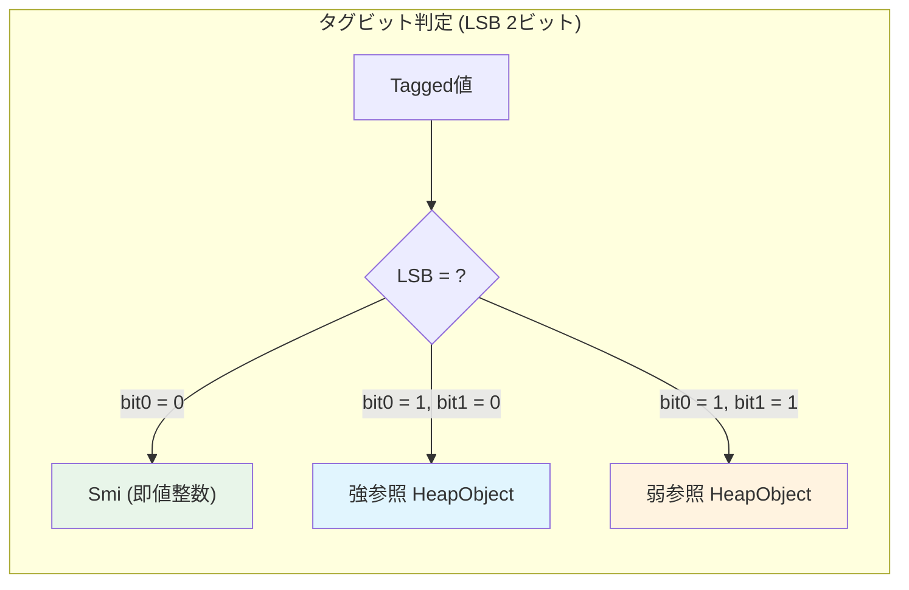

**定数定義** (`include/v8-internal.h`):

| 定数 | 値 | 意味 |
|---|---|---|
| `kSmiTag` | `0` | Smi識別タグ (LSB=0) |
| `kSmiTagSize` | `1` | タグサイズ 1ビット |
| `kHeapObjectTag` | `1` (0b01) | 強参照ヒープオブジェクト |
| `kWeakHeapObjectTag` | `3` (0b11) | 弱参照ヒープオブジェクト |
| `kHeapObjectTagSize` | `2` | HeapObjectタグサイズ 2ビット |
| `kHeapObjectTagMask` | `0x3` | 下位2ビットマスク |

### Smiのメモリレイアウト

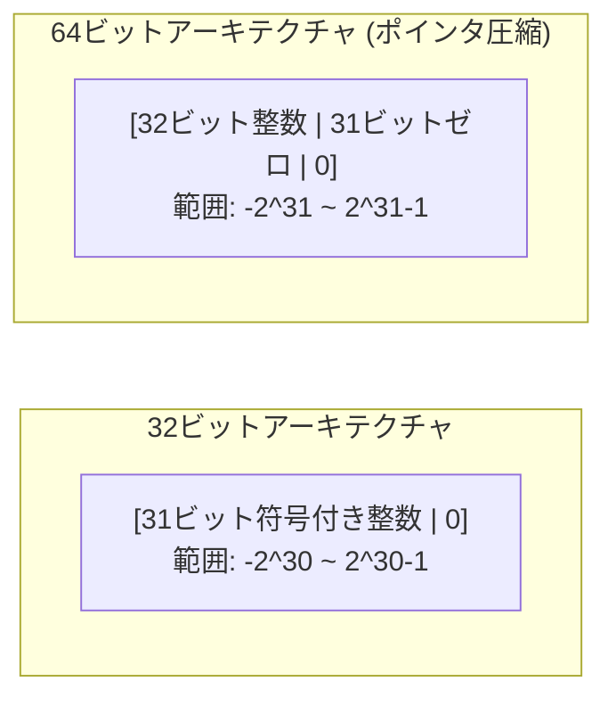

### ポインタ圧縮 (V8_COMPRESS_POINTERS)

64ビットアーキテクチャでは、タグ付きポインタを4バイトに圧縮可能:
- **圧縮**: 上位32ビットをケージベースとして共有
- **展開**: `compressed_value | cage_base`
- ヒープサイズは4GBに制限されるが、メモリ使用量が大幅に削減

---

## 3. InstanceType と Map (Hidden Class)

### Map (Hidden Class) の概要

Map は V8 のランタイム型システムの中核であり、オブジェクトの「形状」(shape) を記述する。

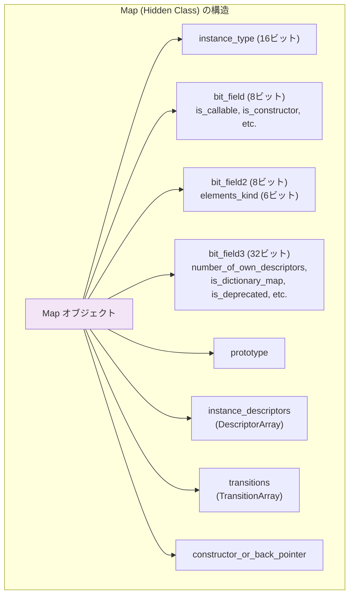

### InstanceType 列挙型

全てのヒープオブジェクトは `InstanceType` によって分類される (`src/objects/instance-type.h`):

```mermaid
graph TB
    subgraph "InstanceType の構成"
        STRING["文字列型 (0 ~ FIRST_NONSTRING-1)<br/>ビット0-6でエンコード"]
        SYMBOL["SYMBOL_TYPE"]
        ODDBALL["ODDBALL_TYPE<br/>(null, undefined, true, false)"]
        HEAPNUM["HEAP_NUMBER_TYPE"]
        BIGINT["BIG_INT_BASE_TYPE"]
        JSOBJECT["JS_OBJECT_TYPE"]
        JSARRAY["JS_ARRAY_TYPE"]
        JSFUNC["JS_FUNCTION_TYPE"]
        JSPROXY["JS_PROXY_TYPE"]
        MAP_T["MAP_TYPE"]
        CODE["CODE_TYPE"]
    end

    STRING --- SYMBOL
    SYMBOL --- ODDBALL
    ODDBALL --- HEAPNUM
    HEAPNUM --- BIGINT
    BIGINT --- JSOBJECT
    JSOBJECT --- JSARRAY
    JSARRAY --- JSFUNC
    JSFUNC --- JSPROXY
    JSPROXY --- MAP_T
    MAP_T --- CODE
```

### 文字列のInstanceTypeビットエンコーディング

文字列型はビットフィールドで効率的にエンコードされる:

| ビット位置 | フィールド | 値 |
|---|---|---|
| 0-2 | 表現種別 | Seq(0), Cons(1), External(2), Sliced(3), Thin(5) |
| 3 | エンコーディング | TwoByte(0), OneByte(1) |
| 4 | 非キャッシュ外部 | Uncached External flag |
| 5 | 内部化フラグ | Internalized(0), NotInternalized(1) |
| 6 | 共有フラグ | Shared string flag |

---

## 4. HeapObject クラス階層

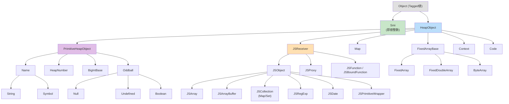

---

## 5. 文字列型階層

V8の文字列型は表現方法とエンコーディングの組み合わせで多数の変種を持つ。

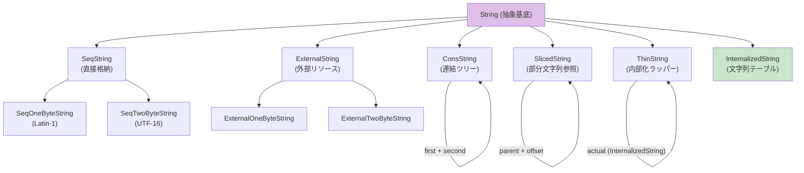

### 直接 vs 間接文字列

| 分類 | 種別 | 説明 |
|---|---|---|
| **直接** | SeqString | データをヒープに直接格納 |
| **直接** | ExternalString | V8ヒープ外のリソースを参照 |
| **間接** | ConsString | 2つの文字列の連結を遅延 |
| **間接** | SlicedString | 親文字列の部分文字列 |
| **間接** | ThinString | 内部化文字列へのラッパー |

---

## 6. 数値型システム

### Smi vs HeapNumber

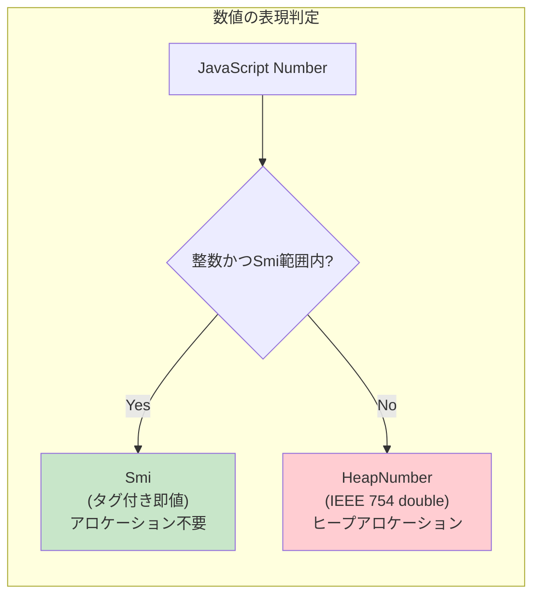

### 数値型の数直線上の配置

```
         OtherSigned32    Negative31   Unsigned30   OtherUnsigned31  OtherUnsigned32   OtherNumber
-Infinity ──┤──────────────┤────────────┤────────────┤────────────────┤─────────────────┤──── +Infinity
           -2^31         -2^30          0           2^30            2^31              2^32

特殊値: MinusZero (-0), NaN
```

### コンパイラ型システムの数値型階層

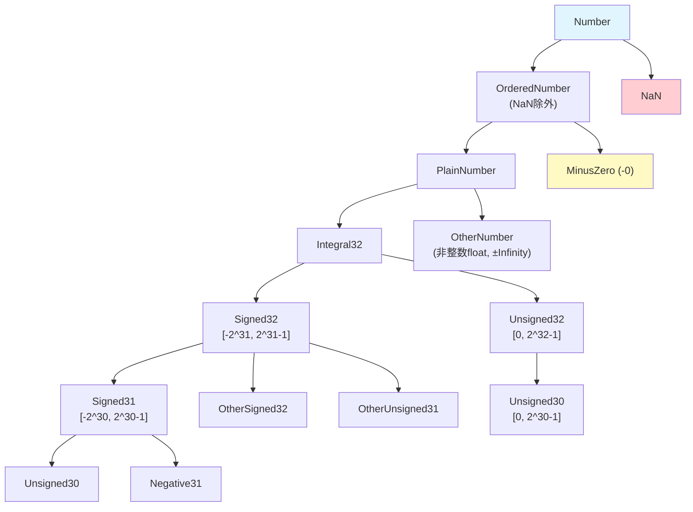

---

## 7. Turbofan コンパイラ型システム (ビットセット型格子)

Turbofanの型システムは**64ビットのビットセット**を基盤とし、集合包含関係による部分型判定を行う。

### Type クラスの内部表現

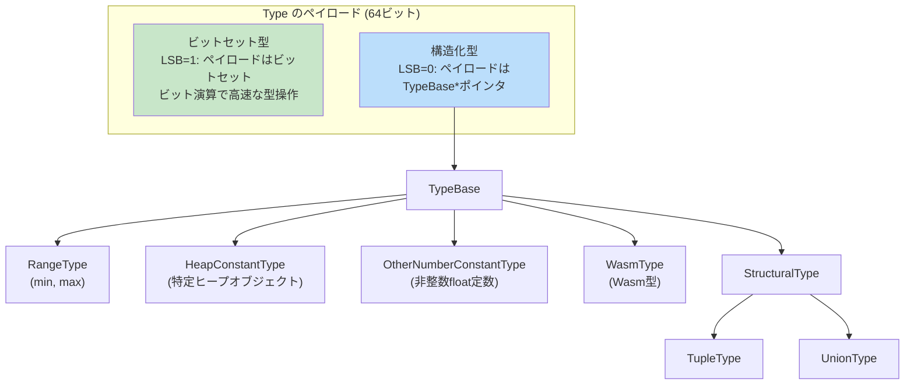

### ビットセット型格子 (完全なリスト)

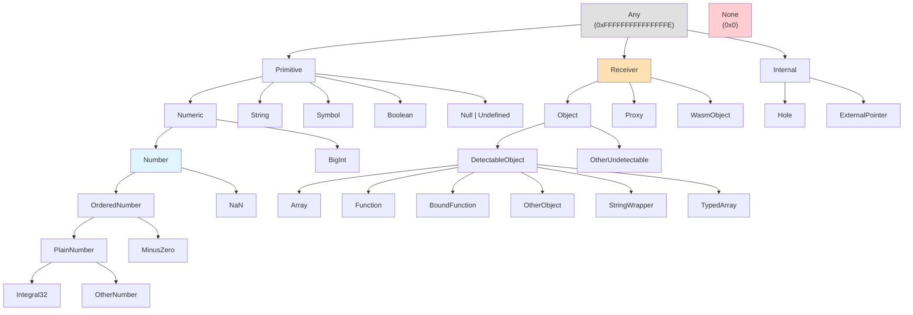

### 主要なビットセット定数

| 型名 | 定義 | 説明 |
|---|---|---|
| `None` | `0x0` | 空型 (Bottom) |
| `Unsigned30` | `1 << 10` | [0, 2^30-1] |
| `Negative31` | `1 << 6` | [-2^30, -1] |
| `Signed31` | `Unsigned30 \| Negative31` | [-2^30, 2^30-1] |
| `Number` | `OrderedNumber \| NaN` | 全数値 |
| `String` | `InternalizedString \| OtherString` | 全文字列 |
| `Receiver` | `Object \| Proxy \| WasmObject` | 全レシーバー |
| `Any` | `0xFFFFFFFFFFFFFFFE` | 全型 (Top) |

---

## 8. 型格子演算

Turbofanの型は数学的な格子(lattice)を形成し、4つの基本演算を持つ。

### 格子の基本性質

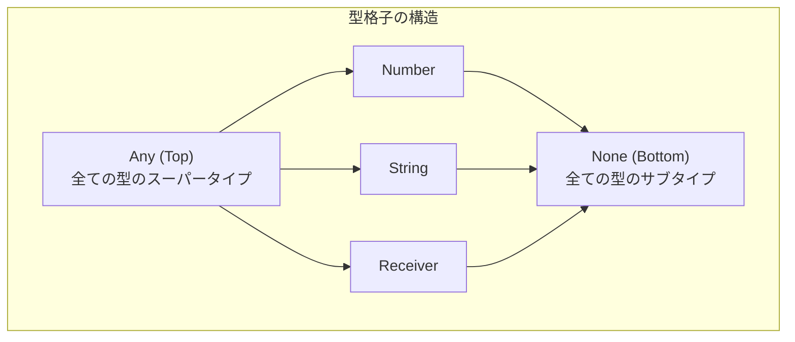

### 4つの基本演算

| 演算 | 実装 | ビットセット演算 | 性質 |
|---|---|---|---|
| **Union** (結合) | `Type::Union(T1, T2)` | ビット OR (`\|`) | 最小上界 (join) |
| **Intersect** (交差) | `Type::Intersect(T1, T2)` | ビット AND (`&`) | 最大下界 (meet) |
| **Is** (部分型) | `T1.Is(T2)` | `(bits1 \| bits2) == bits2` | 反射的, 推移的 |
| **Maybe** (重複) | `T1.Maybe(T2)` | `(lub1 & lub2) != 0` | 可換的 |

### UnionType の不変条件

`UnionType` は正規化された内部表現を維持する:
1. 長さは2以上
2. 要素0はビットセット、他の要素はビットセットではない
3. Range型は最大1つで、インデックス1に配置
4. ネストされたUnionは不可
5. 冗長な要素(他の要素のサブタイプ)は不可
6. Range存在時、ビットセットのnumberビットは空

---

## 9. OperationTyper - 演算の型推論

`OperationTyper` (`src/compiler/operation-typer.cc`) は各演算の出力型を入力型から計算する。

### 算術演算の型推論

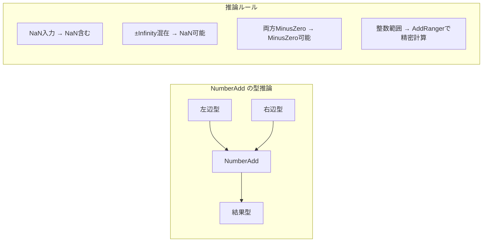

### 主要な型推論ルール

| 演算 | NaN生成条件 | MinusZero生成条件 | 範囲計算 |
|---|---|---|---|
| **Add** | ±Infinity同時 | 両方が-0 | min/maxの4組合せ |
| **Subtract** | 同符号Infinity | -0 - 0 | 同上 |
| **Multiply** | 0 * Infinity | 負 * 0 | 同上 (NaN注意) |
| **Divide** | 0/0 or Inf/Inf | 0-ish / 負 | PlainNumber() |
| **Modulus** | NaN, rhs=0, lhs=Inf | 符号はlhsに従う | 精密範囲 |

### チェック演算と型ナローイング

```
CheckBounds(index, length)  → Intersect(index, Range(0, length.Max()-1))
CheckNumber(type)           → Intersect(type, Number())
CheckString(type)           → Intersect(type, String())
TypeGuard(input, guard)     → Intersect(input, guard)
```

---

## 10. Maglev コンパイラ型システム

Maglev は Turbofan より軽量な中間層JITコンパイラであり、独自の型システムを持つ。

### NodeType (32ビットマスク)

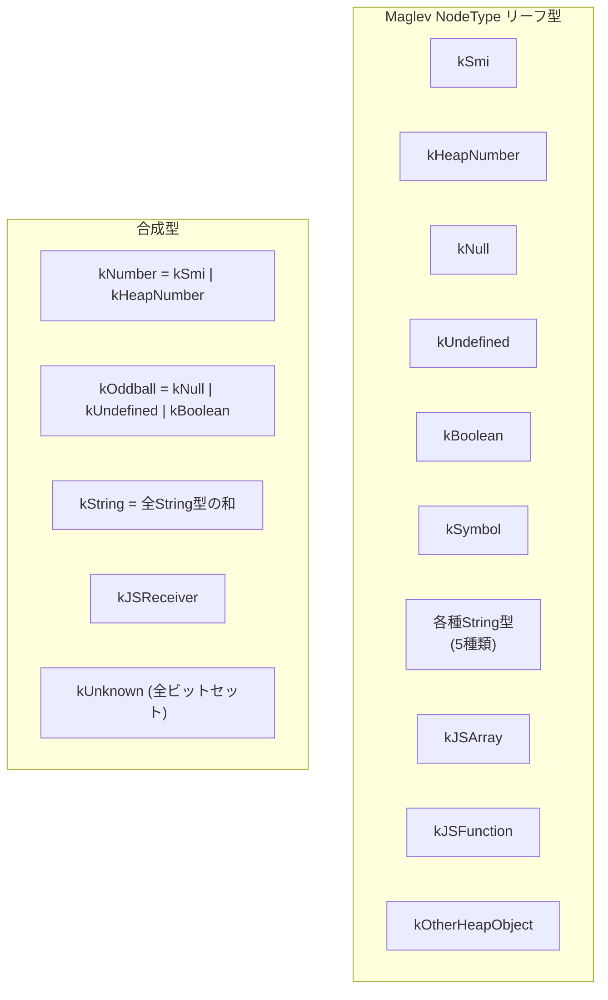

### Turbofan との比較

| 観点 | Maglev | Turbofan |
|---|---|---|
| 型表現 | 32ビットマスク | 64ビットセット + 構造化型 |
| 値表現 | 別トラック (ValueRepresentation) | 型に内包 |
| 不安定型 | 明示的追跡 | なし |
| Range型 | なし (範囲分析は別途) | RangeType あり |
| 型推論 | 静的型 + 動的精緻化 | 投機的型推論 |
| 用途 | 中間層JIT (高速コンパイル) | 最適化JIT (最高性能) |

### ValueRepresentation

```
kTagged        - JS値 (タグ付き)
kInt32         - 32ビット符号付き整数
kUint32        - 32ビット符号なし整数
kFloat64       - 64ビット浮動小数点
kHoleyFloat64  - Float64 (配列ホール対応)
kIntPtr        - ポインタサイズ整数
```

---

## 11. Map遷移とElementsKind

### Map遷移ツリー

オブジェクトにプロパティが追加されると、Map が遷移する。

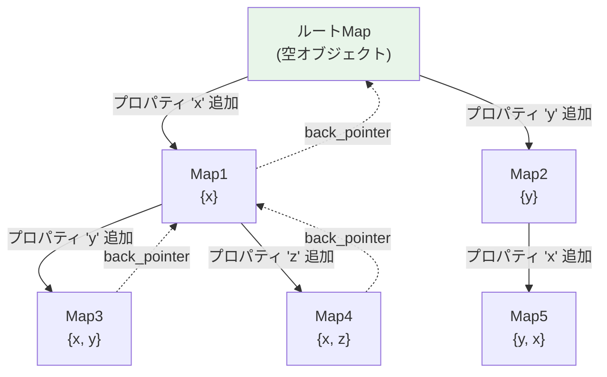

### 遷移の種類

| 種類 | トリガー | 格納方法 |
|---|---|---|
| プロパティ遷移 | プロパティ追加/変更 | TransitionArray (Name → Map) |
| ElementsKind遷移 | 配列要素型変更 | 特殊遷移 (elements_transition_symbol) |
| プロトタイプ遷移 | `__proto__` 変更 | WeakFixedArray |
| 完全性遷移 | seal/freeze | 特殊遷移 (symbol) |

### ElementsKind 遷移格子

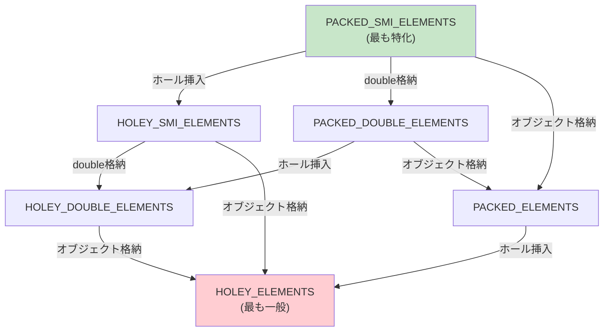

### TransitionArray の構造

```
[0] プロトタイプ遷移 (WeakFixedArray)
[1] サイドステップ遷移 (WeakFixedArray)
[2] 遷移数
[3] キー0 (Name)
[4] ターゲット0 (Weak Map参照)
[5] キー1 (Name)
[6] ターゲット1 (Weak Map参照)
...
```

- 遷移数 ≤ 32: 線形探索
- 遷移数 > 32: ハッシュによるバイナリ探索
- 最大遷移数: 1536 (1024 + 512 スラック)

---

## 12. インラインキャッシュ (IC) と型プロファイリング

### IC状態遷移

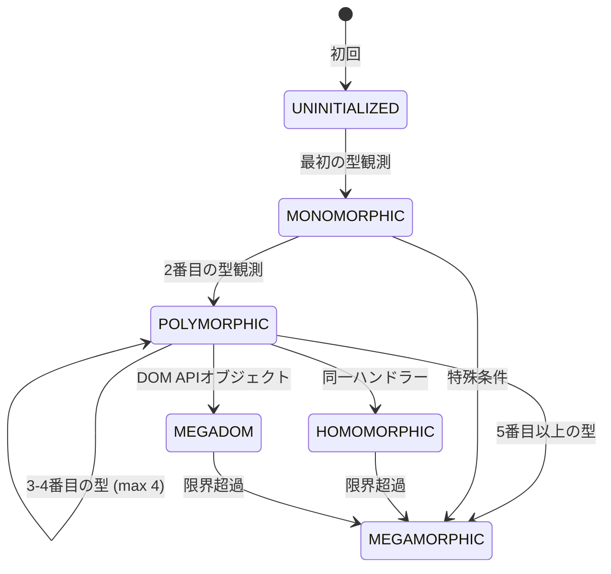

### ICクラス階層

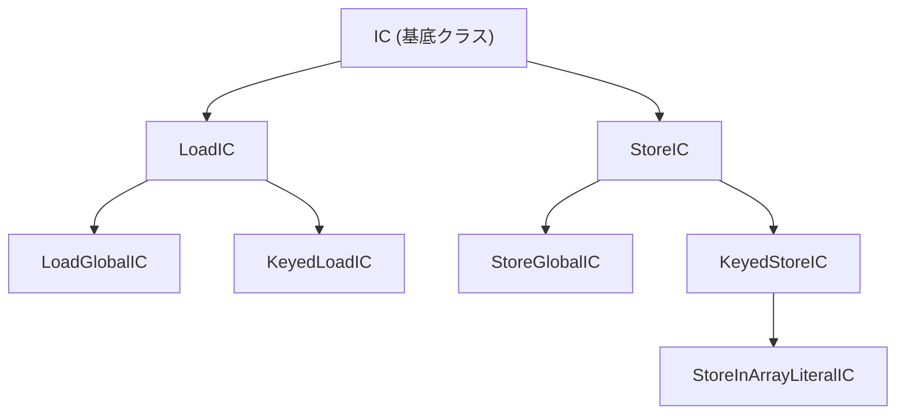

### 型情報の格納形式

| IC状態 | フィードバック格納 | 検索方法 |
|---|---|---|
| UNINITIALIZED | UninitializedSentinel | - |
| MONOMORPHIC | Weak(Map) + Handler | 直接比較 |
| POLYMORPHIC | WeakFixedArray [Map,Handler,...] | 線形走査 |
| HOMOMORPHIC | WeakHomomorphicFixedArray | ハッシュ探索 |
| MEGAMORPHIC | MegamorphicSentinel | スタブキャッシュ |
| MEGADOM | MegaDomSentinel + Handler | 直接ディスパッチ |

---

## 13. フィードバックベクターと型ヒント

### フィードバックベクターの構造

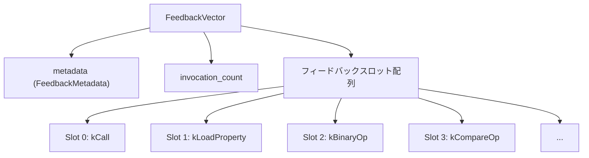

### BinaryOperationFeedback (ビットフィールド)

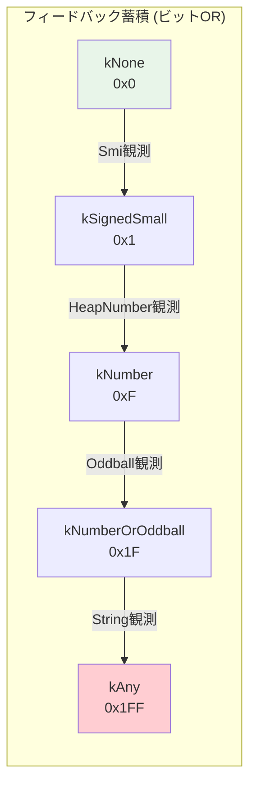

| フィードバック値 | コンパイラヒント | 最適化 |
|---|---|---|
| `kSignedSmall` (0x1) | `kSignedSmall` | Smi算術 |
| `kNumber` (0xF) | `kNumber` | Float64算術 |
| `kNumberOrOddball` (0x1F) | `kNumberOrOddball` | ToNumber変換付き |
| `kString` (0x80) | `kString` | 文字列連結 |
| `kBigInt` (0x60) | `kBigInt` | BigInt演算 |
| `kAny` (0x1FF) | `kAny` | ジェネリック (最適化なし) |

### フィードバックからコンパイラへの流れ

```mermaid
sequenceDiagram
    participant RT as ランタイム (IC)
    participant FV as FeedbackVector
    participant NX as FeedbackNexus
    participant BR as JSHeapBroker
    participant TF as Turbofan

    RT->>FV: UpdateFeedback(feedback | old_feedback)
    Note over FV: ビットORで蓄積
    BR->>NX: GetBinaryOperationFeedback()
    NX->>FV: スロットからSmi読み取り
    NX-->>BR: BinaryOperationHint
    BR-->>TF: ProcessedFeedback
    TF->>TF: 投機的最適化
```

---

## 14. 型ナローイングとTypeGuard

### 型ナローイングの仕組み

型ナローイングは `Type::Intersect()` を使って型を精緻化する。

```mermaid
graph TB
    subgraph "CheckBounds による型ナローイング"
        INPUT["入力: index (Number)"]
        LENGTH["length (PositiveSafeInteger)"]
        CHECK["CheckBounds"]
        OUTPUT["出力: Intersect(index, Range(0, length.Max()-1))"]
    end

    INPUT --> CHECK
    LENGTH --> CHECK
    CHECK --> OUTPUT

    subgraph "例"
        EX1["index: Range(-5, 100)"]
        EX2["length: Range(0, 50)"]
        EX3["結果: Range(0, 49)"]
    end

    style OUTPUT fill:#c8e6c9
```

### チェックノードの種類

| ノード | 型ナローイング | 脱最適化理由 |
|---|---|---|
| `CheckMaps` | 特定のMap集合に制限 | WrongMap |
| `CheckBounds` | Range(0, length-1)に制限 | OutOfBounds |
| `CheckNumber` | Number型に制限 | NotANumber |
| `CheckString` | String型に制限 | NotAString |
| `CheckSmi` | Smi型に制限 | NotASmi |
| `TypeGuard` | 指定型との交差 | - (ガードのみ) |

---

## 15. 機械表現型とSimplifiedLowering

### MachineRepresentation

```mermaid
graph TB
    subgraph "MachineRepresentation"
        INT["整数表現"]
        INT --> W8["kWord8"]
        INT --> W16["kWord16"]
        INT --> W32["kWord32"]
        INT --> W64["kWord64"]

        FP["浮動小数点"]
        FP --> F16["kFloat16"]
        FP --> F32["kFloat32"]
        FP --> F64["kFloat64"]

        TAG["タグ付き"]
        TAG --> TS["kTaggedSigned<br/>(Smi)"]
        TAG --> TP["kTaggedPointer<br/>(HeapObject)"]
        TAG --> TG["kTagged<br/>(Smi or HeapObject)"]

        COMP["圧縮"]
        COMP --> CP["kCompressedPointer"]
        COMP --> CC["kCompressed"]

        SIMD["SIMD"]
        SIMD --> S128["kSimd128"]
        SIMD --> S256["kSimd256"]
    end
```

### 型から表現への変換 (SimplifiedLowering)

SimplifiedLowering は3つのフェーズで型情報を機械表現に変換する:

```mermaid
graph LR
    subgraph "SimplifiedLowering 3フェーズ"
        P["PROPAGATE<br/>(後方伝播)<br/>使用情報を伝播"]
        R["RETYPE<br/>(前方伝播)<br/>フィードバック型を伝播"]
        L["LOWER<br/>(変換)<br/>表現変換ノード挿入"]
    end

    P --> R --> L
```

### 型から表現への変換ルール

| 型 | 表現 | 条件 |
|---|---|---|
| `None` | `kNone` | デッドコード |
| `Signed32` / `Unsigned32` | `kWord32` | 整数演算 |
| `Boolean` | `kBit` | ブール値 |
| `Number` (TruncatingWord32) | `kWord32` | 切り捨て使用 |
| `Number` (Float64) | `kFloat64` | 浮動小数点使用 |
| `BigInt` (Word64) | `kWord64` | 64ビット |
| その他 | `kTagged` | デフォルト |

---

## 16. Torque 型システム

Torque は V8 の組み込み関数を記述するためのドメイン固有言語であり、独自の型システムを持つ。

### Torqueの型宣言

```
// プリミティブ型
type int32 generates 'TNode<Int32T>' constexpr 'int32_t';
type float64 generates 'TNode<Float64T>' constexpr 'double';

// タグ付き型
type Tagged generates 'TNode<MaybeObject>' constexpr 'MaybeObject';
type Smi extends StrongTagged generates 'TNode<Smi>' constexpr 'Smi';

// ユニオン型
type Object = Smi | HeapObject;
type Number = Smi | HeapNumber;
type JSAny = JSPrimitive | JSReceiver;

// クラス型
@abstract extern class HeapObject extends StrongTagged { const map: Map; }
extern class JSArray extends JSObject { length: Number; }
```

### TorqueからC++への型マッピング

```mermaid
graph LR
    subgraph "Torque 型"
        T1["int32"]
        T2["Smi"]
        T3["HeapObject"]
        T4["String"]
    end

    subgraph "C++ 型 (CSA)"
        C1["TNode&lt;Int32T&gt;"]
        C2["TNode&lt;Smi&gt;"]
        C3["TNode&lt;HeapObject&gt;"]
        C4["TNode&lt;String&gt;"]
    end

    subgraph "C++ constexpr 型"
        CE1["int32_t"]
        CE2["Smi"]
        CE3["HeapObject"]
        CE4["String"]
    end

    T1 --> C1
    T2 --> C2
    T3 --> C3
    T4 --> C4

    T1 --> CE1
    T2 --> CE2
    T3 --> CE3
    T4 --> CE4
```

---

## 17. WebAssembly 型システム

V8はWebAssemblyの型システムもサポートする。

### Wasm ValueType

```mermaid
graph TB
    subgraph "Wasm 型階層"
        NUMTYPE["数値型"]
        NUMTYPE --> I32_W["i32 (0x7f)"]
        NUMTYPE --> I64_W["i64 (0x7e)"]
        NUMTYPE --> F32_W["f32 (0x7d)"]
        NUMTYPE --> F64_W["f64 (0x7c)"]
        NUMTYPE --> V128_W["v128 (0x7b)"]

        REFTYPE["参照型"]
        REFTYPE --> FUNCREF["funcref"]
        REFTYPE --> EXTERNREF["externref<br/>(JSオブジェクトとブリッジ)"]
        REFTYPE --> ANYREF["anyref"]
        REFTYPE --> EQREF["eqref"]
        REFTYPE --> I31REF["i31ref"]
        REFTYPE --> STRUCTREF["structref"]
        REFTYPE --> ARRAYREF["arrayref"]
    end
```

### Wasm GC 型サブタイピング

```mermaid
graph TB
    ANY_W["any"]
    ANY_W --> EQ["eq"]
    ANY_W --> STR_W["string"]

    EQ --> I31["i31"]
    EQ --> STRUCT_W["struct"]
    EQ --> ARRAY_W["array"]

    I31 --> NONE_W["none"]
    STRUCT_W --> NONE_W
    ARRAY_W --> NONE_W

    FUNC_W["func"]
    FUNC_W --> NOFUNC["nofunc"]

    EXTERN_W["extern"]
    EXTERN_W --> NOEXTERN["noextern"]

    style NONE_W fill:#ffcdd2
    style NOFUNC fill:#ffcdd2
    style NOEXTERN fill:#ffcdd2
```

---

## 18. 脱最適化と型フィードバックループ

### 脱最適化の流れ

```mermaid
sequenceDiagram
    participant OPT as 最適化コード
    participant DEOPT as Deoptimizer
    participant FV as FeedbackVector
    participant INTERP as インタプリタ
    participant REOPT as 再コンパイル

    OPT->>OPT: CheckMaps(obj, expected_maps)
    Note over OPT: Map不一致検出!
    OPT->>DEOPT: 即時脱最適化 (WrongMap)
    DEOPT->>DEOPT: フレーム変換
    DEOPT->>FV: UpdateFeedback (投機モード変更)
    DEOPT->>INTERP: バイトコード実行に復帰
    Note over FV: kDisallowSpeculation に遷移
    INTERP->>REOPT: ティアリング閾値到達
    Note over REOPT: 投機を制限して再コンパイル
```

### 脱最適化の種類

| 種類 | トリガー | 例 |
|---|---|---|
| **即時 (Eager)** | チェックノード失敗 | WrongMap, NotASmi, NotANumber |
| **遅延 (Lazy)** | 依存関係無効化 | MapDeprecated, PrototypeChange, FieldTypeChange |

### 投機モード状態遷移

```mermaid
stateDiagram-v2
    [*] --> AllowSpeculation
    AllowSpeculation --> DisallowBoundsCheck: 脱最適化発生
    DisallowBoundsCheck --> DisallowSpeculation: 再度脱最適化
    DisallowSpeculation --> DisallowSpeculation: 永続的
```

### 主要な型関連脱最適化理由

| 理由 | 分類 | 説明 |
|---|---|---|
| `NotASmi` | Eager | 値がSmiでない |
| `WrongMap` | Eager | Map不一致 |
| `WrongInstanceType` | Eager | InstanceType不一致 |
| `NotANumber` | Eager | 数値でない |
| `NotAString` | Eager | 文字列でない |
| `MapDeprecated` | Lazy | Mapが非推奨化 |
| `PrototypeChange` | Lazy | プロトタイプチェーン変更 |
| `FieldTypeChange` | Lazy | フィールド型変更 |
| `FieldRepresentationChange` | Lazy | フィールド表現変更 |

---

## 19. コンパイラパイプラインにおける型情報フロー

### Turbofan パイプライン全体像

```mermaid
graph TB
    subgraph "グラフ生成"
        GB["GraphBuilderPhase<br/>(バイトコード → IR)"]
        INLINE["InliningPhase<br/>(関数インライン化)"]
    end

    subgraph "型付けと最適化"
        TRIM["EarlyGraphTrimmingPhase"]
        TYPER["TyperPhase<br/>★ 型情報生成 ★"]
        TL["TypedLoweringPhase<br/>★ 型消費 ★"]
        LOOP["LoopPeeling/ExitElimination"]
        LE["LoadEliminationPhase<br/>★ 型消費 ★"]
        EA["EscapeAnalysisPhase<br/>★ 型消費 ★"]
        TA["TypeAssertionsPhase<br/>★ 型アサーション挿入 ★"]
        SL["SimplifiedLoweringPhase<br/>★★ 最大の型消費者 ★★<br/>表現選択"]
    end

    subgraph "型情報なしの後半"
        UNTYPE["UntyperPhase<br/>(DEBUGのみ: 型削除)"]
        GL["GenericLoweringPhase"]
        EO["EarlyOptimizationPhase"]
        SCHED["ComputeScheduledGraph"]
    end

    GB --> INLINE --> TRIM --> TYPER
    TYPER --> TL --> LOOP --> LE
    LE --> EA --> TA --> SL
    SL --> UNTYPE --> GL --> EO --> SCHED

    style TYPER fill:#c8e6c9,stroke:#2e7d32,stroke-width:3px
    style SL fill:#bbdefb,stroke:#1565c0,stroke-width:3px
    style UNTYPE fill:#ffcdd2
```

### 各フェーズでの型の役割

| フェーズ | 型の役割 | 主要な型操作 |
|---|---|---|
| **TyperPhase** | **生成** | 全ノードに型を割り当て |
| **TypedLoweringPhase** | 消費 | JS演算を簡約演算に変換 |
| **LoadEliminationPhase** | 消費 | 冗長なロード除去、型ナローイング |
| **EscapeAnalysisPhase** | 消費 | アロケーション逃避解析 |
| **TypeAssertionsPhase** | 生成 | 型アサーションノード挿入 |
| **SimplifiedLoweringPhase** | **最大消費** | 型→機械表現変換 |
| **UntyperPhase** | 削除 | (DEBUGのみ) 全型を除去 |

### 型の寿命

型情報は `TyperPhase` で生成され、`SimplifiedLoweringPhase` まで約8フェーズにわたって活用される。その後、表現変更により型が不正確になる可能性があるため削除される。

---

## 20. 付録: 主要ファイル一覧

### コンパイラ型システム

| ファイル | 行数 | 内容 |
|---|---|---|
| `src/compiler/turbofan-types.h` | ~740 | 型格子定義、ビットセット型 |
| `src/compiler/turbofan-types.cc` | ~1100 | Union/Intersect/Is 実装 |
| `src/compiler/turbofan-typer.h` | ~71 | Typerクラスインターフェース |
| `src/compiler/turbofan-typer.cc` | ~2787 | 全IRオペコードの型計算 |
| `src/compiler/operation-typer.h` | ~148 | OperationTyperインターフェース |
| `src/compiler/operation-typer.cc` | ~1405 | 演算の型推論ルール |
| `src/compiler/type-cache.h` | ~227 | 頻用型のキャッシュ |
| `src/compiler/simplified-lowering.cc` | ~6099 | 型→表現変換 |
| `src/compiler/representation-change.h/cc` | - | 表現変換ノード挿入 |
| `src/compiler/simplified-operator.h` | - | チェック演算・アクセス型 |
| `src/compiler/pipeline.cc` | ~3600+ | コンパイラパイプライン |

### ランタイム型システム

| ファイル | 内容 |
|---|---|
| `src/objects/map.h` / `map.cc` | Map (Hidden Class) |
| `src/objects/instance-type.h` | InstanceType列挙型 |
| `src/objects/string.h` | 文字列型階層 |
| `src/objects/heap-number.h` | HeapNumber |
| `src/objects/smi.h` | Smi |
| `src/objects/oddball.h` | Oddball (null, undefined, boolean) |
| `src/objects/tagged.h` | Tagged<T>テンプレート |
| `src/objects/casting.h` | Is<T>/Cast<T>テンプレート |
| `src/objects/transitions.h` | Map遷移システム |
| `src/objects/elements-kind.h` | ElementsKind |
| `src/objects/feedback-vector.h` | フィードバックベクター |
| `src/objects/descriptor-array.h` | DescriptorArray |

### Maglev

| ファイル | 内容 |
|---|---|
| `src/maglev/maglev-node-type.h` | NodeType定義 |
| `src/maglev/maglev-ir.h` | ValueRepresentation |
| `src/maglev/maglev-known-node-aspects.h` | KnownNodeAspects |

### IC システム

| ファイル | 内容 |
|---|---|
| `src/ic/ic.h` / `ic.cc` | ICクラス階層 |
| `src/ic/handler-configuration.h` | ハンドラーエンコーディング |

### Torque

| ファイル | 内容 |
|---|---|
| `src/builtins/base.tq` | 基本型定義 |
| `src/torque/types.h` / `types.cc` | 型システム実装 |

### WebAssembly

| ファイル | 内容 |
|---|---|
| `src/wasm/value-type.h` | ValueType定義 |
| `src/wasm/struct-types.h` | Struct/Array型 |
| `src/wasm/canonical-types.h` | 型正規化 |
| `src/wasm/wasm-subtyping.h` | サブタイピング |

### その他

| ファイル | 内容 |
|---|---|
| `include/v8-internal.h` | タグ定数、Smi定義 |
| `src/common/globals.h` | グローバル定数 |
| `src/codegen/machine-type.h` | MachineRepresentation |
| `src/deoptimizer/deoptimize-reason.h` | 脱最適化理由 |
| `src/compiler/use-info.h` | UseInfo/Truncation |

---

## 結論

V8の型システムは、動的型付き言語であるJavaScriptを高速に実行するために設計された**多層アーキテクチャ**である。

1. **ポインタタギング**により1ビットでSmi判別
2. **Map/InstanceType**によりオブジェクト構造を効率的に記述
3. **IC/フィードバックベクター**により実行時型パターンを収集
4. **Maglev**が中間層で高速な型ベース最適化を実施
5. **Turbofan**が精密な型格子を使って最大限の最適化を実施
6. **脱最適化**により型推測の失敗から安全に回復
7. **投機モード制御**により無限脱最適化ループを防止

各層が密接に連携し、JavaScript の動的な性質を尊重しながら、静的型付き言語に匹敵する性能を実現している。
